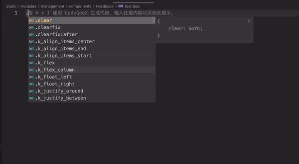
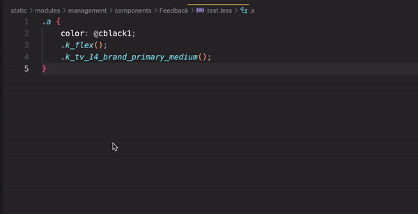
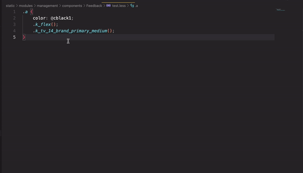

# less-easy-helper 

🔧 一个方便使用 less 的 vscode 插件

## 使用
1. 初次使用，打开项目中的 less 文件会提示选择 less 文件目录（该文件目录下存放 less 文件，定义变量、方法、class 类名），支持多选；下一次相同的操作会提示是否更新之前的选择。
2. 支持在用户配置文件 `setting.json` 中手动修改配置项: `less-easy-helper.paths` `less-easy-helper.notice`

## 当前版本提供的功能
1. 在 less 文件中键入 `@` 自动补全变量名，如果是色值变量也会显示色值；输入 `.` 自动补全方法名。

2. 鼠标悬浮在变量或方法上显示其值。

3. 对于 less 变量或类名，`cmd` 或 `ctrl` 显示下划线点击可以直接跳转到其定义位置。

